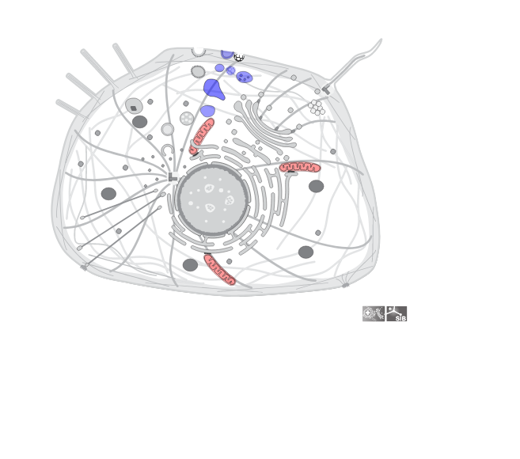
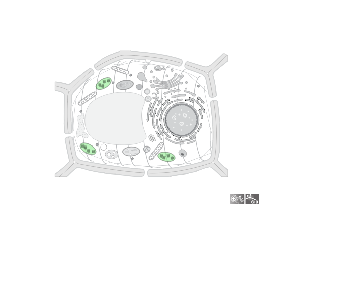
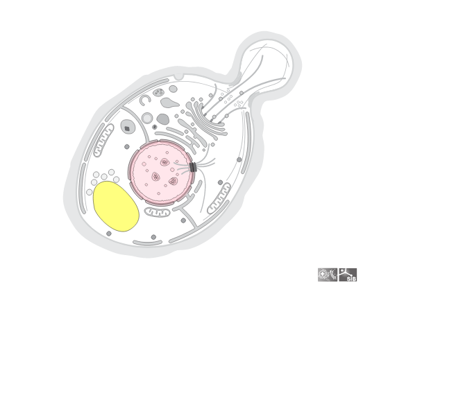

<!-- README.md is generated from README.Rmd. Please edit that file -->

# drawCell

<!-- badges: start -->
<!-- badges: end -->

The goal of drawCell is to easily obtain nice cell pictures in R!

## Installation

To obtain the cell pictures, `drawCell` connects to the [SwissBioPics
API](https://www.swissbiopics.org/) so an internet connection is
required.

``` r
# install.packages("devtools")
devtools::install_github("svalvaro/drawCell")
```

## Usage

You can use drawCell in two ways, one is to use the Web application
created with Shiny. We will have this app deployed soon. You can run it
locally with:

``` r
drawCell::drawCellShiny()
```

If you want to get the cells pictures in your Rmarkdown documents,
reports, you just need to use the main function `drawCell()`. It
requires the [taxonomy id](https://www.ncbi.nlm.nih.gov/taxonomy/) of
your species of interest, and one or multiple SL codes for subcellular
locations that will be colored. The SL codes for each subcellular
location can be found at [Uniprot](https://www.uniprot.org/docs/subcell)
and
[uniprotkb_sl2go](http://current.geneontology.org/ontology/external2go/uniprotkb_sl2go).

## Examples

To generate a cell of Homo sapiens (Taxonomy id: `9606`) with
highlighted Endoplasmic Reticulum (SL code: `0095`) and lipid droplets
(SL code: `0154`):

``` r
library(drawCell)

drawCell(organism_identifier = '9606', list_sl_colors = list("SL0173" = "red", "SL0101" = "blue"))
```

<!-- -->

The taxonomy id for *Quercus ilex* a common tree in the south of Spain
is `58334` and as an example I will use the SL code of the chloroplast:
`0049`.

``` r
drawCell(organism_identifier = '58334', list_sl_colors = list("SL0049" = 'lightgreen'))
```

<!-- -->

We can also obtain pictures of viruses, yeast, and pretty much
everything that exists!

For the baker’s yeast *Saccharomyces cerevisiae* whose taxonomy id is
`4932` we will highlight the nucleus: `0191` and the vacuole: `0272`.

``` r
drawCell(organism_identifier = '4932', list_sl_colors = list("SL0191" = "pink", "SL0272" = "yellow"))
```

<!-- -->
