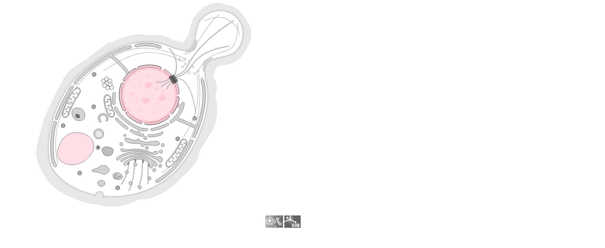

<!-- README.md is generated from README.Rmd. Please edit that file -->

# drawCell

<!-- badges: start -->
<!-- badges: end -->

The goal of drawCell is to easily obtain nice cell pictures in R!

## Installation

drawCell needs the package
[webshot2](https://github.com/rstudio/webshot2), which needs to be
installed prior to the installation of **drawCell**.

To obtain the cell pictures, draCell connects to the [SwissBioPics
API](https://www.swissbiopics.org/) so an internet connection is
required.

``` r
# install.packages("devtools")
devtools::install_github("svalvaro/drawCell")
```

## Example

This is a basic example which shows you how to solve a common problem:

It requires the [taxonomy id](https://www.ncbi.nlm.nih.gov/taxonomy/) of
your species of interest, and one or multiple SL codes for subcellular
locations that will be colored. The SL codes for each subcellular
location can be found at [Uniprot](https://www.uniprot.org/docs/subcell)
and
[uniprotkb\_sl2go](http://current.geneontology.org/ontology/external2go/uniprotkb_sl2go).

The taxonomy id for *Quercus ilex* a common tree in the south of Spain
is `58334` and as an example I will use the SL code of the chloroplast:
`0049`.

``` r
library(drawCell)
drawCell(taxonomy_id = '58334', sl_ids = '0049', color = 'lightblue', delay = 3)
```


We can also obtain pictures of viruses, yeast, and pretty much
everything that exists!

For the baker’s yeast *Saccharomyces cerevisiae* whose taxonomy id is
`4932` we will highlight the nucleus: `0191` and the vacuole: `0272`.

``` r
drawCell(taxonomy_id = '4932', sl_ids = c('0191', '0272'), color = 'pink')
```


