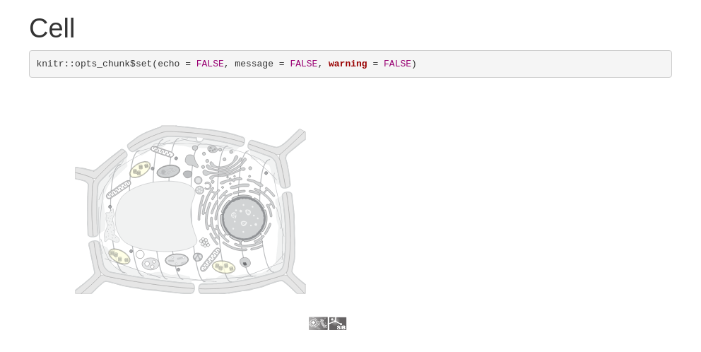

<!-- README.md is generated from README.Rmd. Please edit that file -->

# drawCell

<!-- badges: start -->
<!-- badges: end -->

The goal of drawCell is to easily obtain nice cell pictures in R!

## Installation

drawCell is not available at CRAN or bioconductor since it uses the
package [webshot2](https://github.com/rstudio/webshot2), which needs to
be installed.

``` r
# install.packages("devtools")
devtools::install_github("svalvaro/MQmetrics")
```

## Example

This is a basic example which shows you how to solve a common problem:

It requires the [taxonomy id](https://www.ncbi.nlm.nih.gov/taxonomy/) of
your species of interest, and one or multiple SL codes for subcellular
locations that will be colored. [This
dataset](http://current.geneontology.org/ontology/external2go/uniprotkb_sl2go)
contains the SL codes for each subcellular location.

The taxonomy id for *Quercus ilex* a common tree in the south of Spain
is `58334` and as an example I will use the SL code of the chloroplast:
`0049`.

``` r
library(drawCell)

drawCell(taxonomy_id = '58334', sl_ids = '0049')
#>   |                                                                              |                                                                      |   0%  |                                                                              |.........                                                             |  12%
#>   ordinary text without R code
#> 
#>   |                                                                              |..................                                                    |  25%
#> label: unnamed-chunk-2 (with options) 
#> List of 1
#>  $ echo: logi FALSE
#> 
#>   |                                                                              |..........................                                            |  38%
#>   ordinary text without R code
#> 
#>   |                                                                              |...................................                                   |  50%
#> label: unnamed-chunk-3
#>   |                                                                              |............................................                          |  62%
#>   ordinary text without R code
#> 
#>   |                                                                              |....................................................                  |  75%
#> label: unnamed-chunk-4 (with options) 
#> List of 1
#>  $ echo: logi FALSE
#> 
#>   |                                                                              |.............................................................         |  88%
#>   ordinary text without R code
#> 
#>   |                                                                              |......................................................................| 100%
#> label: unnamed-chunk-5 (with options) 
#> List of 1
#>  $ echo: logi FALSE
#> 
#> 
#> /usr/lib/rstudio/bin/pandoc/pandoc +RTS -K512m -RTS html_generator.knit.md --to html4 --from markdown+autolink_bare_uris+tex_math_single_backslash --output /home/alvaro/R/x86_64-pc-linux-gnu-library/4.1/drawCell/cell_pictures/cell_picture.html --lua-filter /home/alvaro/R/x86_64-pc-linux-gnu-library/4.1/rmarkdown/rmarkdown/lua/pagebreak.lua --lua-filter /home/alvaro/R/x86_64-pc-linux-gnu-library/4.1/rmarkdown/rmarkdown/lua/latex-div.lua --self-contained --variable bs3=TRUE --standalone --section-divs --template /home/alvaro/R/x86_64-pc-linux-gnu-library/4.1/rmarkdown/rmd/h/default.html --no-highlight --variable highlightjs=1 --variable theme=bootstrap --include-in-header /tmp/RtmpWmvneJ/rmarkdown-str138d3497b5520.html --mathjax --variable 'mathjax-url:https://mathjax.rstudio.com/latest/MathJax.js?config=TeX-AMS-MML_HTMLorMML'
```


